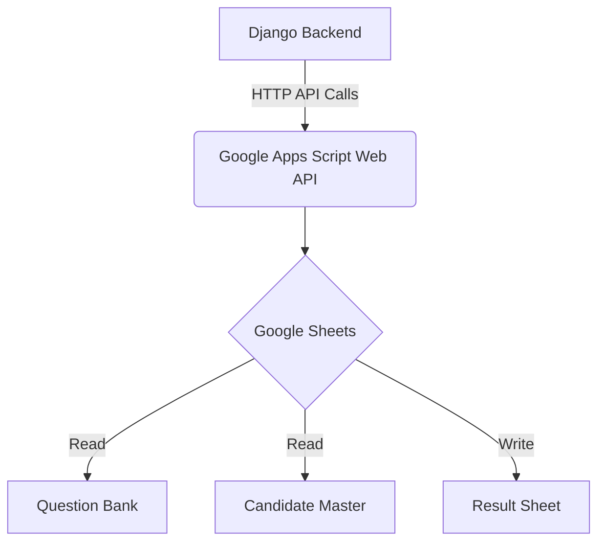

# 🚀 Edu-Score
## Internal Company MCQ Assessment Portal

**Edu-Score** is a secure, domain-based internal assessment platform built for internship shortlisting.
It integrates Django with Google Sheets (via Google Apps Script) to dynamically manage question banks, candidate data, and result reporting.

> **Note:** This is not a public portal. It is designed for controlled internal company usage.

---

## 🏗 Architecture Overview

The system follows a layered architecture where Django serves as the secure backend and Google Sheets acts as a dynamic data source.



- **Django Backend**: Handles authentication, test orchestration, scoring, and security.
- **MySQL**: Stores transactional data (assessments, attempts, logs).
- **Google Sheets**: Acts as dynamic CMS for questions and candidate lists.
- **Google Apps Script**: Acts as middleware API layer.

---

## 🧰 Technology Stack

| Layer | Technology |
| :--- | :--- |
| **Backend** | Django |
| **Database** | MySQL |
| **Frontend** | Bootstrap |
| **External Integration** | Google Apps Script |
| **Data Storage (External)** | Google Sheets |

---

## ✨ Key Features

### 🔹 Domain-Based Dynamic Tests
- Domains are auto-loaded from Google Sheet tabs.
- **No code change required** when a new domain tab is added.

### 🔹 Candidate Validation
- Candidates are validated against a "Candidate Master" Google Sheet.
- Only candidates with **status = approved** can attempt tests.
- **Domain-based isolation** ensures candidates only access their assigned domain.

### 🔹 Secure Test Execution
- **One attempt per candidate** enforced by the system.
- **Server-side scoring** prevents answer tampering.
- **Strict Timer Validation** on the backend.
- **Prevents Overlap**: Ensuring only one active test per domain at any given time.

### 🔹 Automated Result Reporting
- Result sheet tab created dynamically (e.g., `Android_YYYY_MM_DD_HH_MM`) upon test creation.
- Results appended automatically after submission.
- Qualification determined by administrator-defined cutoff scores.

### 🔹 Internal Role-Based System
- **Admin**: Creates tests, manages domains, views results.
- **Candidate**: Log in securely, attempt assigned domain test.

---

## 📂 Project Structure

```text
edu_score/
│
├── assessment/
│   ├── models.py        # Database models (Assessment, Attempt)
│   ├── views.py         # Request handlers
│   ├── forms.py         # Django forms
│   ├── services.py      # Business logic & scoring engine
│   ├── utils.py         # Apps Script API communication
│   └── urls.py
│
├── EduScore/
│   ├── settings.py      # Project settings
│   └── urls.py
│
├── templates/           # HTML templates
└── static/              # CSS/JS assets
```

---

## 🛠 Installation & Setup

### 1️⃣ Clone Repository
```bash
git clone https://github.com/Er-Mayur/Edu-Score.git
cd eduscore
```

### 2️⃣ Create Virtual Environment
```bash
python3 -m venv venv
source venv/bin/activate
pip install -r requirements.txt
```

### 3️⃣ MySQL Database Setup
Ensure MySQL is running, then create the database:
```sql
CREATE DATABASE eduscore_db CHARACTER SET utf8mb4 COLLATE utf8mb4_unicode_ci;
```

Update your `.env` or `settings.py` with DB credentials:
```bash
DB_NAME=eduscore_db
DB_USER=root
DB_PASSWORD=your_password
```

### 4️⃣ Configure Environment Variables
Create a `.env` file (or update `settings.py` directly for dev):
```ini
DEBUG=True
SECRET_KEY=your-secret-key
APPS_SCRIPT_URL=https://script.google.com/macros/s/YOUR_DEPLOYMENT_ID/exec
APPS_SCRIPT_TOKEN=EDUSCORE_2026_SECRET
```

### 5️⃣ Run Migrations
```bash
python manage.py migrate
```

### 6️⃣ Create Admin User
```bash
python manage.py createsuperuser
```

### 7️⃣ Start Server
```bash
python manage.py runserver
```
Access the portal at: `http://127.0.0.1:8000/`

---

## 📊 Google Sheets Structure

The system requires 3 separate Google Sheet IDs configured in the Apps Script:

### 1️⃣ Question Bank Sheet
- **Tabs**: One per domain (e.g., `Android`, `Web`).
- **Columns**: `question_id`, `question_text`, `option_a`, `option_b`, `option_c`, `option_d`, `correct_option`, `marks`, `negative_marks`

### 2️⃣ Candidate Master Sheet
- **Tabs**: Matches domain names.
- **Columns**: `candidate_id`, `name`, `email`, `phone`, `status`
- **Logic**: Only `status = approved` allows login.

### 3️⃣ Result Sheet
- **Tabs**: Created dynamically by the system.
- **Columns**: `candidate_id`, `name`, `email`, `domain`, `test_code`, `score`, `total_marks`, `percentage`, `result_status`, `timestamp`

---

## 🔗 Google Apps Script Setup

1. Go to [Google Apps Script](https://script.google.com/).
2. Create a new project and paste the provided API code.
3. Deploy as **Web App**.
   - **Execute as**: Me
   - **Who has access**: Anyone
4. Copy the Web App URL and update your Django settings.

---

## 🔐 Security Features
- **Token-based API authentication**.
- **Server-side scoring** (answers never sent to client).
- **One attempt per candidate**.
- **Domain isolation**.
- **CSRF protection**.

---

## 📈 Performance & Design
- **Single API call** for fetching questions per session.
- **Atomic transactions** for result submission to ensure data integrity.
- **Separation of concerns**: Thin views, fat services logic.

---

## 👨‍💻 Author
Built as an internal company-grade assessment engine for internship shortlisting.

## 📄 License
Internal use only.
